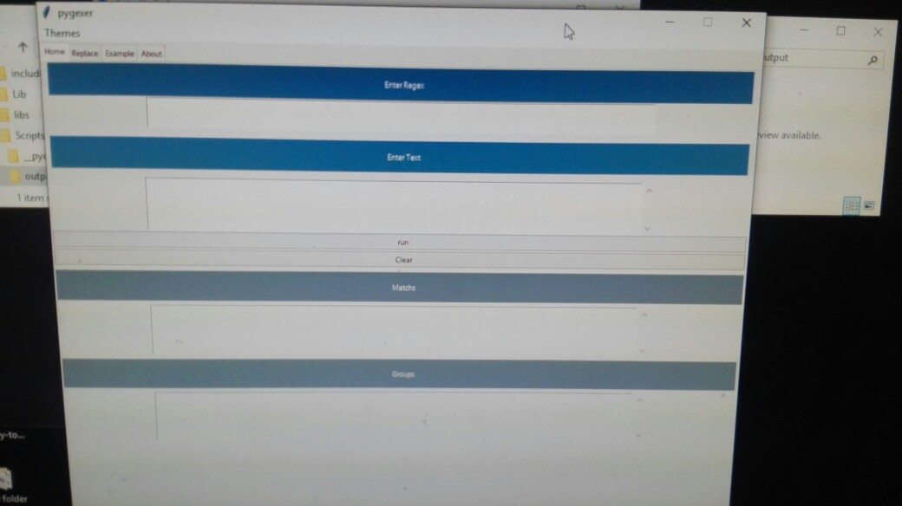
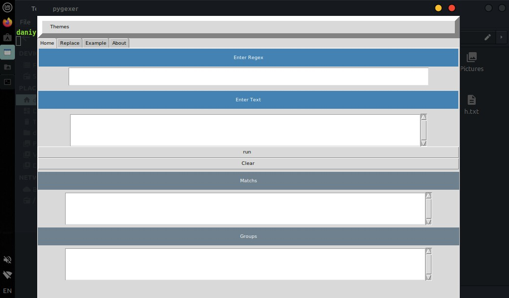
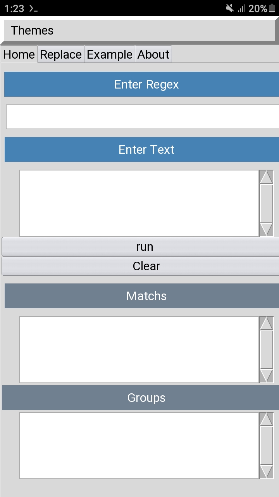

# pygexer


This is an open source project that allows you to start regex processing in graphical environment  by offline

and pygexer available for linux , android , windows  and other operating system.

# installation 

## windows 


To run it on Windows, just install Python3 from [python.org](https://www.python.org/downloads/).and in the next step , download project zip file and extract it.Now open the powershell or command prompt in the src directory for the project
And execute the following command

```python
python3 pygexer-desktop.py
```

or you can use the executable file in
``` shell
src/exec/
```
And this way you can easily run the project on Windows operating system. 


## Linux


To run this program on GNU Linux operating systems, in first step please install python3 , tkinter and git with your package manager.
Now get project from github:
```shell
git clone https://github.com/masih-dev/pygexer.git
```
And execute the following command
```shell
python3 pygexer/src/pygexer-desktop.py 
```

## android 
for run project on android please get 
[Pydroid3](https://play.google.com/store/apps/details?id=ru.iiec.pydroid3 "Link to google play")
from Google play and open it.
Now open the pygexer-mobile.py file and run it with pydroid3.




# Thanks

Finally, I would like to thank my good friends Sina and GC and Irakli Googoochani for helping me build this project.


# Support
You can send me your comments and criticisms.
- gmail : masihgh8@gmail.com
